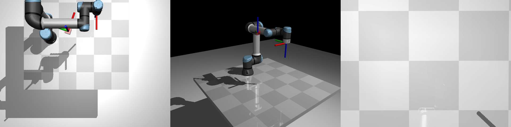
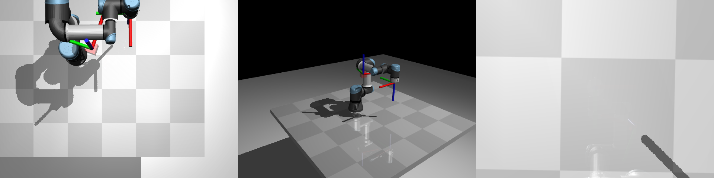
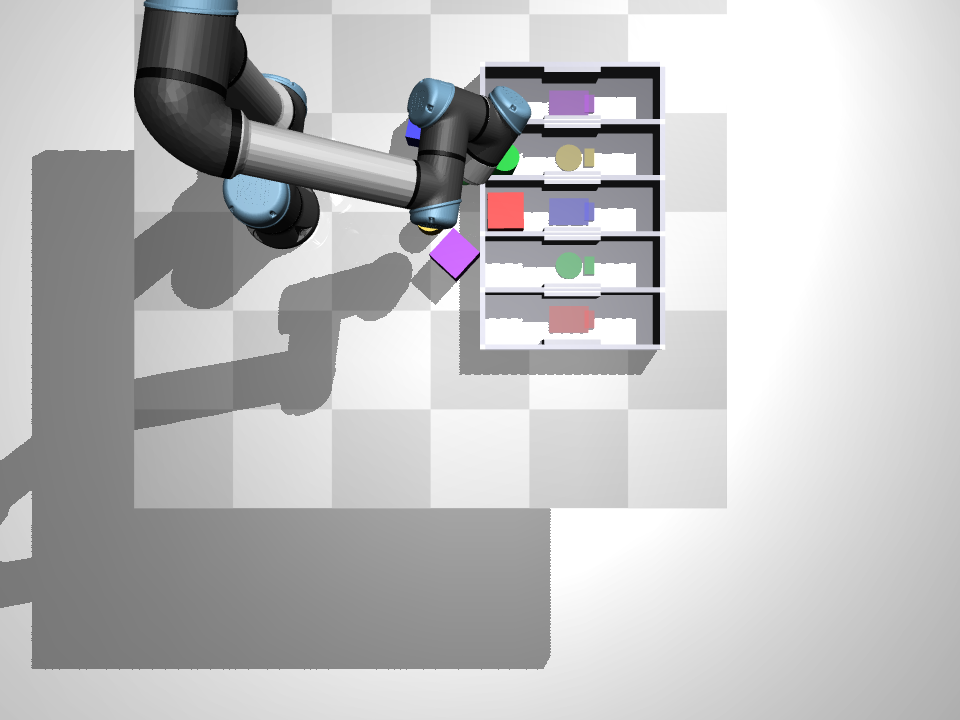

# 🤖 MuJoCo Robot — UR Arm RL Environments

Modular reinforcement-learning environments for **UR5e** and **UR3e** robot arms
in [MuJoCo](https://mujoco.readthedocs.io/), with [Gymnasium](https://gymnasium.farama.org/)
wrappers for training and keyboard/gamepad teleop for interactive testing.

<p align="center">
  
</p>
<p align="center"><em>UR5e reach task — top, side, and end-effector camera views</em></p>

<video src="videos/ik_hold/ik_hold_ur5e_20260208_102814.mp4" width="320" height="240" controls></video>


---

## 📁 Project Structure

```
mujoco-robot/
├── src/mujoco_robot/               # Main Python package
│   ├── __init__.py
│   ├── robots/                     # Robot models & configuration
│   │   ├── configs.py              # RobotConfig dataclass + registry
│   │   ├── ur5e.xml                # UR5e MJCF (Menagerie OBJ meshes)
│   │   ├── ur3e.xml                # UR3e MJCF (scaled UR5e meshes)
│   │   └── assets/ur5e/            # 20 OBJ mesh files
│   ├── core/                       # Reusable engine modules
│   │   ├── ik_controller.py        # Damped-least-squares IK solver
│   │   ├── collision.py            # Self-collision detector
│   │   └── xml_builder.py          # MJCF XML injection utilities
│   ├── envs/                       # Gymnasium-ready environments
│   │   ├── reach_env.py            # URReachEnv + ReachGymnasium
│   │   └── slot_sorter_env.py      # URSlotSorterEnv + SlotSorterGymnasium
│   ├── training/                   # RL training utilities
│   │   ├── callbacks.py            # BestEpisodeVideoCallback (SB3)
│   │   ├── train_reach.py          # PPO training for reach task
│   │   └── train_slot_sorter.py    # PPO training for slot sorter
│   ├── teleop/                     # Interactive controllers
│   │   ├── keyboard.py             # Keyboard teleop (both tasks)
│   │   ├── gamepad.py              # DualShock/DualSense gamepad
│   │   └── gui.py                  # Tkinter GUI with buttons & camera
│   └── scripts/                    # CLI entry points
│       ├── teleop.py               # Unified teleop launcher
│       ├── train.py                # Unified training launcher
│       └── visual_smoke.py         # Scripted rollout video
├── docs/images/                    # README screenshots
├── pyproject.toml                  # Package metadata & dependencies
├── .gitignore
└── README.md
```

---

## 🚀 Quick Start

### 1. Install dependencies

```bash
# Core (MuJoCo + Gymnasium)
pip install mujoco numpy gymnasium

# Training (optional)
pip install stable-baselines3 imageio[ffmpeg] tensorboard

# Gamepad (optional)
pip install pygame
```

Or install everything at once:

```bash
pip install -e ".[dev]"
```

### 2. Run teleop (keyboard)

```bash
# Reach task with UR5e
python -m mujoco_robot.scripts.teleop --task reach --robot ur5e

# Slot sorter
python -m mujoco_robot.scripts.teleop --task slot_sorter

# Slot sorter with gamepad
python -m mujoco_robot.scripts.teleop --task slot_sorter --gamepad
```

### 3. Run teleop (GUI)

```bash
# GUI with clickable buttons, camera view, and joint readouts
python -m mujoco_robot.scripts.teleop --task reach --robot ur5e --gui

# Slot sorter GUI (includes grip button)
python -m mujoco_robot.scripts.teleop --task slot_sorter --gui
```

The GUI provides:
- **D-pad** arrow buttons for ±X / ±Y movement
- **Z ± buttons** for vertical movement
- **Yaw ↺ / ↻ buttons** for end-effector rotation
- **Camera selector** dropdown — switch between **Top**, **Side**, and **End-Effector** views
- **Coordinate frame toggle** — control in **Base (World)** frame or **End-Effector (Tool)** frame
- **Live camera** view (selectable)
- **Joint angle** bar displays with numeric readouts
- **EE position & yaw** readout
- **Speed slider** to control movement speed
- **Reset** and **Emergency Stop** buttons
- **Grip toggle** (slot sorter only)
- Full **keyboard support** (W/A/S/D/R/F/Q/E/X/C/Tab) alongside the buttons

**Coordinate frames:**

| Frame | Behaviour |
|-------|-----------|
| 🌐 Base (World) | D-pad axes = fixed world X/Y. Default mode. |
| 🔧 End-Effector (Tool) | D-pad "forward" follows the tool's heading. |

**Keyboard controls:**

| Key     | Action      |
|---------|-------------|
| W / S   | ±Y movement (or Fwd / Back in EE frame) |
| A / D   | ±X movement (or Left / Right in EE frame) |
| R / F   | ±Z movement |
| Q / E   | ±Yaw        |
| C       | Cycle camera (top → side → ee_cam) |
| Tab     | Toggle coordinate frame (Base ↔ EE) |
| SPACE   | Grip toggle (slot sorter only) |
| X       | Emergency stop |

### 4. Train with PPO

```bash
# Reach task (default: Cartesian IK actions)
python scripts/train.py --task reach --robot ur5e --total-timesteps 500000

# Reach task (joint-space actions, Isaac Lab style)
python scripts/train.py --task reach --robot ur5e --action-mode joint --total-timesteps 500000

# Slot sorter
python scripts/train.py --task slot_sorter --total-timesteps 1000000

# Monitor in TensorBoard
tensorboard --logdir runs
```

### 4. Use as a Python library

The environment is a **fully standard [Gymnasium](https://gymnasium.farama.org/) environment**
and works with **any** Gymnasium-compatible RL library — Stable-Baselines3, CleanRL,
RLlib, rl_games, SKRL, and more.

#### Via `gymnasium.make()` (recommended for portability)

```python
import gymnasium
import mujoco_robot  # registers envs on import

# Create the environment — works with ANY Gymnasium-compatible library
env = gymnasium.make("MuJoCoRobot/Reach-v0", robot="ur3e")
obs, info = env.reset()

for _ in range(1000):
    action = env.action_space.sample()
    obs, reward, terminated, truncated, info = env.step(action)
    if terminated or truncated:
        obs, info = env.reset()

env.close()
```

#### Direct instantiation

```python
from mujoco_robot.envs import ReachGymnasium

# All environment parameters are configurable via kwargs
env = ReachGymnasium(
    robot="ur5e",
    render_mode="rgb_array",    # "rgb_array" for video, None for headless
    action_mode="joint",        # "joint" (6-D) or "cartesian" (4-D IK)
    reach_threshold=0.05,       # 5 cm position tolerance
    yaw_threshold=0.35,         # ~20° yaw tolerance
    hold_seconds=2.0,           # hold at goal 2 s before resample
)
obs, info = env.reset()
obs, reward, terminated, truncated, info = env.step(env.action_space.sample())
```

#### Using different RL libraries

```python
# ── Stable-Baselines3 ───────────────────────────────────
from stable_baselines3 import PPO, SAC, TD3
import mujoco_robot

env = gymnasium.make("MuJoCoRobot/Reach-v0", robot="ur3e")
model = PPO("MlpPolicy", env)        # swap to SAC, TD3, etc.
model.learn(total_timesteps=500_000)

# ── CleanRL ──────────────────────────────────────────────
# Uses gymnasium.make() directly — no changes needed.
# python cleanrl/ppo_continuous_action.py --env-id MuJoCoRobot/Reach-v0

# ── RLlib ────────────────────────────────────────────────
from ray.rllib.algorithms.ppo import PPOConfig
config = PPOConfig().environment("MuJoCoRobot/Reach-v0")
algo = config.build()
algo.train()
```

#### Low-level API (for custom loops / teleop)

```python
from mujoco_robot.envs import URReachEnv

env = URReachEnv(robot="ur3e", time_limit=0)
obs = env.reset()
result = env.step([0.5, 0.0, 0.0, 0.0])  # returns StepResult dataclass
print(f"EE pos: {result.info['ee_pos']}, dist: {result.info['dist']:.3f}")
```

#### Registered environments

| Gymnasium ID | Class | Action Dim | Obs Dim | Description |
|--------------|-------|-----------|---------|-------------|
| `MuJoCoRobot/Reach-v0` | `ReachGymnasium` | 6 (joint) / 4 (cartesian) | 31 / 29 | Reach + hold goal pose |

---

## 🖼️ Environments

### Reach Task

Move the end-effector to a random 3-D goal **position and yaw orientation**
(red cube with RGB coordinate axes).  Goals spawn **in front** of the robot
in the reachable workspace.  When the EE reaches the goal and **holds** there
for 2 seconds, a new goal is sampled — the episode only ends on time-out
(no early termination on success).

| UR5e | UR3e |
|------|------|
|  |  |

### Slot Sorter Task

Pick up coloured objects and place them into matching slots.

<p align="center">
  
</p>

---

## 🏗️ Architecture

### Robot Models (dual-geom collision)

Each robot MJCF uses a **dual-geom architecture** for robust collision handling:

- **`viz` class** geoms — visual only (`contype=0`), provide the rendered appearance.
- **`col` class** geoms — collision only (`contype=1`), used for physics contacts.
- Only **6 adjacent body pairs** are excluded from collision (shoulder↔base, etc.).

### Environments

| Environment | Action Dim | Obs Dim | Description |
|-------------|-----------|---------|-------------|
| `URReachEnv` (cartesian) | 4 | 29 | Move EE to random 3-D pose (pos + yaw) via IK |
| `URReachEnv` (joint) | 6 | 31 | Move EE to random 3-D pose via joint offsets |
| `URSlotSorterEnv` | 5 | 71 | Pick colored objects → matching slots |

Both environments use:
- **Position servo actuators** (kp=200) for stable joint control.
- **Damped-least-squares IK** for Cartesian end-effector commands.
- **Dense reward shaping** to help RL exploration.

### Core Modules

| Module | Purpose |
|--------|---------|
| `IKController` | Cartesian → joint velocity via Jacobian pseudo-inverse |
| `CollisionDetector` | Counts non-adjacent robot link contacts |
| `xml_builder` | Programmatic MJCF injection (goals, cameras, etc.) |

---

## 🧪 Running Tests

```bash
pytest tests/ -v
```

Expected: **24 tests**, all passing.

---

## 📊 Supported Robots

| Robot | Reach | Link Lengths Source |
|-------|-------|---------------------|
| UR5e  | ~0.85 m | Official UR ROS2 description |
| UR3e  | ~0.50 m | Official UR ROS2 description |

To add a new robot:
1. Create an MJCF XML in `mujoco_robot/robots/`.
2. Register it in `mujoco_robot/robots/configs.py` with a `RobotConfig` entry.
3. Register/reuse an actuator profile in `mujoco_robot/robots/actuators.py`.

---

## 📦 Dependencies

| Package | Version | Purpose |
|---------|---------|---------|
| `mujoco` | ≥ 3.1 | Physics simulation |
| `numpy` | any | Numerical computation |
| `gymnasium` | ≥ 1.0 | RL environment API |
| `stable-baselines3` | ≥ 2.0 | PPO training (optional) |
| `imageio` | any | Video recording (optional) |
| `pygame` | any | Gamepad input (optional) |

---

## 📝 License

MIT

## Task Layer (IsaacLab-style)

- `mujoco_robot.tasks.reach` and `mujoco_robot.tasks.slot_sorter` provide per-task config dataclasses and factories.
- `mujoco_robot.tasks.registry` provides `TASK_REGISTRY`, `get_task_spec`, and `make_task(...)`.
- `mujoco_robot.envs` contains low-level simulation environments; `mujoco_robot.tasks` is the high-level task composition layer.
- `mujoco_robot.envs.slot_sorter_env` remains a backward-compatible shim to the new `mujoco_robot.envs.slot_sorter` package.

### Reach MDP Overrides

```python
from mujoco_robot.tasks.reach import ReachTaskConfig, make_reach_env
from mujoco_robot.envs.reach.mdp import make_default_reach_mdp_cfg, RewardTermCfg

def my_dense_bonus(_env, _ctx):
    return 1.0

mdp_cfg = make_default_reach_mdp_cfg()
mdp_cfg.reward_terms = (RewardTermCfg("bonus", my_dense_bonus, weight=0.5),)

cfg = ReachTaskConfig(robot="ur3e", control_variant="ik_rel", mdp_cfg=mdp_cfg)
env = make_reach_env(cfg)
obs = env.reset(seed=0)
```
